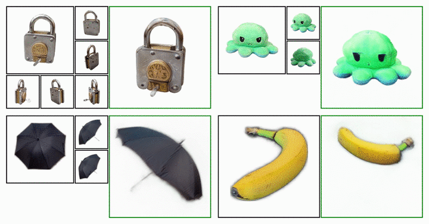

# UpFusion: Novel View Diffusion from Unposed Sparse View Observations

### [Project Page](https://upfusion3d.github.io/) | [ArXiv](https://arxiv.org/abs/2312.06661)

[Bharath Raj Nagoor Kani](https://bharathrajn.com/)<sup>1</sup>, [Hsin-Ying Lee](http://hsinyinglee.com/)<sup>2</sup>, [Sergey Tulyakov](http://www.stulyakov.com/)<sup>2</sup>, [Shubham Tulsiani](https://shubhtuls.github.io/)<sup>1</sup> <br/>
<sup>1</sup>Carnegie Mellon University, <sup>2</sup>Snap Research

<p align="center">
  
</p>

<p align="center"> <b>UpFusion</b> can create a 3D asset of an object from <b>unposed</b> sparse-view images. </p>

---

## Release Overview

As of 11th December 2023, our current release contains links to model weights and inference code that can create 3D representations of objects from 1-6 sparse-view images. We aim to release the training code as well in the near future.

---

## Setup

### Environment Setup

The script `setup_env.sh` contains all necessary commands to setup the environment, and can be used by running `source setup_env.sh`. 

This script assumes that the user has `conda` already installed, and creates a new conda environment named `upfusion` with python `3.10` and all the necessary packages to run the inference code. Once the environment is installed, the user can activate it by running `conda activate upfusion`.

For reference, the contents of `setup_env.sh` are:

```bash
# Create a new conda environment.
conda create -n upfusion -c conda-forge python=3.10 -y
conda activate upfusion

# Install some pre-requisite packages that may be necessary for installing some downstream packages.
conda install -c conda-forge ninja cxx-compiler=1.3.0 -y
conda install -c fvcore -c iopath -c conda-forge fvcore iopath -y

# Install pytorch.
pip install torch==2.0.1+cu118 torchvision==0.15.2+cu118 torchaudio==2.0.2+cu118 --index-url https://download.pytorch.org/whl/cu118

# Install several packages through requirements.txt
pip install -r requirements.txt

# Build some final packages.
pip install ./external/gridencoder
pip install ./external/raymarching

```

### Model Weights

Download model weights from google drive using this [link](https://drive.google.com/file/d/1uaRgObmF85ThXHL6Tv2V6nC6caAAYUtB/view?usp=sharing) and place them in a directory of your choice.

You can extract the tar file using `tar -xzvf /path/to/weights.tar.gz`. Once extracted, please verify that the directory containing the weights has the following structure:

```
weights/
├── upsrt.pt
└── upfusion2d.pt
```

---

## Inference

Once the required setup steps are complete, you can run UpFusion to create 3D representations of objects from 1-6 masked input images (i.e., images of objects with white background). We provide some example data in the `./examples` directory.

To run UpFusion on the `lock` instance from the example data, you can run the below command (please replace `/path/to` with the appropriate paths).

```bash
python -m scripts.run_distillation \
	--in_dir ./examples/lock \
	--out_dir /path/to/output_dir \
	--weights_dir /path/to/weights \
	--name lock
```

The `run_distillation.py` commands performs SDS based optimization (UpFusion 3D in the paper) to train a NeRF such that its renderings have high likelihood under the trained diffusion model. This command takes a little more than an hour to train on an A5000 GPU. Once trained, the weights of the NeRF model are saved as a `.pt` file in `/path/to/output_dir`. Renderings obtained from the NeRF are stored as GIFs in `/path/to/output_dir/render_gifs`.

#### Using Custom Data

It is easy to use UpFusion on your own custom images. The script `run_distillation.py` requires masked input images (i.e., images of objects with white background) of size `(256, 256)`. In case you do not have masked images, you can consider use our helper script to create masked images. For more information about the script, its limitations and alternative options, please refer to this [link](docs/extracting_masks.md). 

Once masked images of size `(256, 256)` are available, place them in a folder. Make sure that the folder only has the required input images and no additional content. Then, you can run the below command to run the distillation script (please replace `/path/to` with the appropriate paths).

```bash
python -m scripts.run_distillation \
	--in_dir /path/to/input_dir \
	--out_dir /path/to/output_dir \
	--weights_dir /path/to/weights \
	--name custom_data
```

---

## Training

Coming soon!

---

## Acknowledgements

We thank [Zhizhuo Zhou](https://www.zhiz.dev/) for helpful discussions about SparseFusion. We also thank [Naveen Venkat](https://serverprocessor.wordpress.com/) and [Mayank Agarwal](https://mayankgrwl97.github.io/) for their insights on the Co3Dv2 dataset and SRT. This research was supported by a gift funding from Snap and Cisco.

---

## Citation

If you find this work useful, please consider citing UpFusion as:

```
@article{upfusion2023,
  author    = {Nagoor Kani, Bharath Raj and Lee, Hsin-Ying and Tulyakov, Sergey and Tulsiani, Shubham},
  title     = {UpFusion: Novel View Diffusion from Unposed Sparse View Observations},
  journal   = {arXiv preprint arXiv:2312.06661},
  year      = {2023},
}
```

--- 